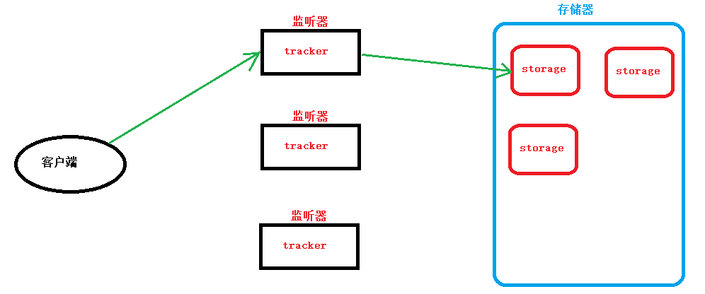
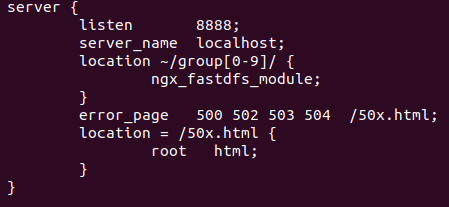

# FastDFS 和 Nginx

## FastDFS

### 三端：

- 客户端：client
- 监听端（监听服务器）：tracker
- 存储端（存储服务器）：storage



### 使用步骤：

1. 监听服务器定时查看存储服务器的状态。
2. client 访问监听服务器， 获取到可用的 存储服务器地址。
3. 客户端根据返回的地址，访问存储服务器。
4. 存储服务器存储文件，并返回凭证。如：“组名/M00/00/00/xxxxxx” 

### 与以往的区别

- 图片需要上传！但是不需要下载。 直接按 “凭证” 展示到 浏览器即可。
- fastDFS 不提供 “展示图片” 功能。 —— Nginx。


### fastDFS 安装和配置

- 安装 ： 参照 《fastdfs.pdf》实施
- 配置：
    - 修改sudo vim /etc/fdfs/storage.conf。	—— tracker_server=你自己的IP:22122
    - 修改sudo vim /etc/fdfs/tracker.conf        —— 不需要。
    - 修改sudo vim /etc/fdfs/client.conf          —— tracker_server=你自己的IP:22122

- 启动 fastDFS：

    1.  启动 存储服务器 storage：   sudo fdfs_storaged /etc/fdfs/storage.conf

    2.   启动 监听服务器 tracker： sudo fdfs_trackerd /etc/fdfs/tracker.conf

    3. ps aux | grep fdfs

        


## Nginx

- 安装： fastDFS 的 Nginx 插件。
    - 参照 《fastdfs.pdf》 3.2.5.7安装fastdfs-nginx-module

- 拷贝：
    - 将 解压缩的 fastdfs-master目录中 mod_fastdfs.conf 拷贝， 放到 /etc/fdfs/ 目录下。
    - 将 解压缩的 fastdfs-master目录中 http.conf  拷贝， 放到 /etc/fdfs/ 目录下。 --- 不需要修改
    - 将 解压缩的 fastdfs-master目录中 mime.types 拷贝， 放到 /etc/fdfs/ 目录下。 --- 不需要修改

- 修改 mod_fastdfs.conf
    - sudo  vim mod_fastdfs.conf 文件， 修改： tracker_server=你自己的IP地址:22122
- 修改 Nginx：
    - sudo vim /usr/local/nginx/conf/nginx.conf 
    - 参考 《fastdfs.pdf》 3.2.5.7 安装fastdfs-nginx-module 第 9 条。修改：



- 启动nginx
    - 启动命令：`sudo /usr/local/nginx/sbin/nginx`
    - 提示：类似于：`ngx_http_fastdfs_set pid=78481`
    - 查看：
        - ps aux | grep nginx

# Go语言 使用 FastDFS和Nginx

- 《fastdfs.pdf》中， 3.2.6 小结中的 方法， 已经过时！不要使用！

-  去 github 搜索 “fastdfs”  --- https://github.com/tedcy/fdfs_client

-  使用开源包，必须确认在  /etc/fdfs/client.conf 中 添加了 配置

    ```shell
    maxConns=10		# 设置最大连接数。
    ```

- 查看 demo：client_test.go ，确认，我们使用的方法：

    ```go
    client, err := NewClientWithConfig("fdfs.conf")
    	参数： /etc/fdfs/client.conf
    
    client.UploadByBuffer([]byte("hello world"), "go"); 
    	参1： []byte 的图片数据。
    	参2： 去除 “.” 文件后缀名。
    ```

    

### 测试

```go
package main

import (
	"github.com/tedcy/fdfs_client"
	"fmt"
)

func main()  {
	// 初始化客户端 --- 配置文件
	clt, err := fdfs_client.NewClientWithConfig("/etc/fdfs/client.conf")
	if err != nil {
		fmt.Println("初始化客户端错误, err:", err)
		return
	}

	// 上传文件 -- 尝试文件名上传! 传入到 storage
	resp, err := clt.UploadByFilename("头像1.jpg")

	fmt.Println(resp, err)
}

-- 运行成功后 去 ~/fastdfs/storage/data/00/00/ 中查看！   ls | grep  xxx
```


# 用户头像上传

1.  获取图片文件, 静态文件对象

    ```go
    file, _ := ctx.FormFile("avatar")
    ```

2. 上传头像到fastdfs 中, 按字节流。

    ```go
    clt, _ := fdfs_client.NewClientWithConfig("/etc/fdfs/client.conf")
    
    // 打开文件,读取文件内容
    f, _ := file.Open()			// 只读打开.
    
    buf := make([]byte, file.Size)	// 按文件实际大小,创建切片.
    
    f.Read(buf)		// 读取文件内容, 保存至buf缓冲区.
    
    // go语言根据文件名获取文件后缀
    fileExt := path.Ext(file.Filename)		// 传文件名, 获取文件后缀---- 带有"."
    
    // 按字节流上传图片内容
    remoteId, _ := clt.UploadByBuffer(buf, fileExt[1:])
    
    ```

3. 获取session , 得到当前用户

    ```go
    userName := sessions.Default(ctx).Get("userName")
    ```

4. web/model/modelFunc.go 中添加函数， 更新用户头像到数据中。 将 图片 凭证写入 avatar_url

    ```go
    func UpdateAvatar(userName, avatar string) error {
    	// update user set avatar_url = avatar, where name = username
    	return GlobalConn.Model(new(User)).Where("name = ?", userName).
    		Update("avatar_url", avatar).Error
    }
    ```

    

5. 根据用户名, 更新用户头像  --- MySQL数据库

    ```go
    model.UpdateAvatar(userName.(string), remoteId)
    ```

6.  这里 不在 remoteId 前，拼接 Nginx 使用的 IP:port。 这样写，会写死到 数据库。在 web/controller/user.go 中 修改 GetUserInfo() 函数， 在获取用户信息时， 添加  Nginx 使用的 IP:port。

    ```go
    func GetUserInfo(ctx *gin.Context) {
        ......
        temp["name"] = user.Name
    	temp["mobile"] = user.Mobile
    	temp["real_name"] = user.Real_name
    	temp["id_card"] = user.Id_card
        // 修改 avatar_url 写入的值。
    	temp["avatar_url"] = "http://192.168.6.108:8888/" + user.Avatar_url
    
    	resp["data"] = temp
    }
    ```

7. 成功，写出返回值给前端

    ```go
    resp := make(map[string]interface{})

    resp["errno"] = utils.RECODE_OK
    resp["errmsg"] = utils.RecodeText(utils.RECODE_OK)

    temp := make(map[string]interface{})
    temp["avatar_url"] = "http://192.168.6.108:8888/" + remoteId
    resp["data"] = temp

    ctx.JSON(http.StatusOK, resp)
    ```


